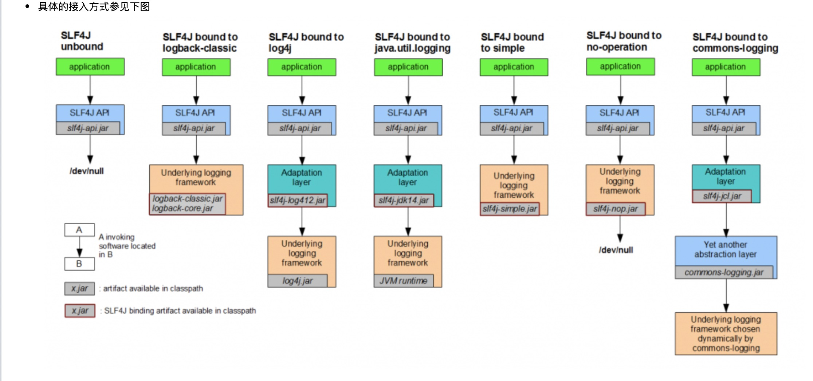
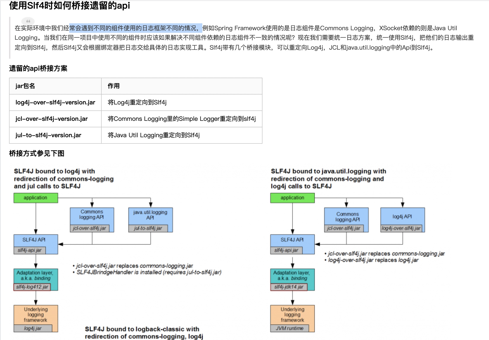

## java 常用的日志框架
[常见日志框架详解](https://www.cnblogs.com/chenhongliang/p/5312517.html#java%E6%97%A5%E5%BF%97%E6%A6%82%E8%BF%B0)

### slf4j (日志的门面接口slf4j-api)

Slf4j的设计思想比较简洁，使用了Facade设计模式，Slf4j本身只提供了一个slf4j-api-version.jar包
这个jar中主要是日志的抽象接口，jar中本身并没有对抽象出来的接口做实现。

slf4j 门面接口

针对不同的日志的实现类(桥接类)：

### commons logging(作为和slf4j同样的日志api)

### 桥接重定向

### 桥接注意事项
多个日志jar包形成死循环的条件	产生原因
log4j-over-slf4j.jar和slf4j-log4j12.jar同时存在	由于slf4j-log4j12.jar的存在会将所有日志调用委托给log4j。但由于同时由于log4j-over-slf4j.jar的存在，会将所有对log4j api的调用委托给相应等值的slf4j,所以log4j-over-slf4j.jar和slf4j-log4j12.jar同时存在会形成死循环
jul-to-slf4j.jar和slf4j-jdk14.jar同时存在	由于slf4j-jdk14.jar的存在会将所有日志调用委托给jdk的log。但由于同时jul-to-slf4j.jar的存在，会将所有对jul api的调用委托给相应等值的slf4j，所以jul-to-slf4j.jar和slf4j-jdk14.jar同时存在会形成死循环